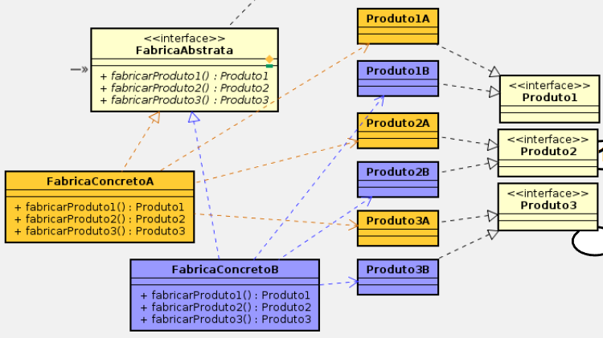
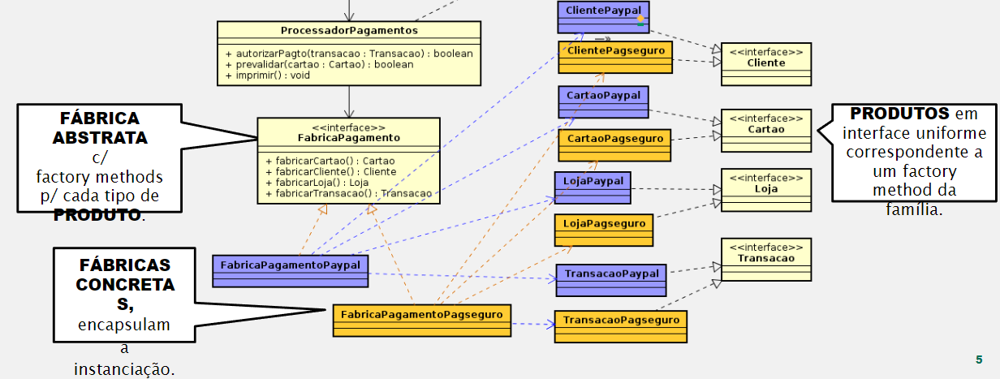

# Qual a finalidade do padrão Abstract Factory?

O padrão Abstract Factory é um padrão de projeto criacional que permite a criação de famílias de objetos relacionados ou dependentes sem especificar suas classes concretas.

A estrutura do padrão Abstract Factory é composta por um supertipo "FabricaAbstrata" que pode ser uma classe abstrata ou uma interface, as subclasses que herdam/implementam esse supertipo são chamadas de fabricasConcretas(representam uma família de produtos cada) elas são responsáveis por retornar uma intância do respectivo tipo de produto solicitado, temos tambpem supertipos de "Produto" como interfaces, ele possui tipos de subclasses equivalente ao número de família de produtos

Além disso, o padrão Abstract Factory permite que o código funcione com qualquer família de produtos, sem depender de classes concretas. Isso é possível porque a ‘FabricaAbstrata’ e os supertipos de ‘Produto’ são geralmente implementados como interfaces ou classes abstratas. O padrão Abstract Factory encapsula o código que cria e configura objetos de produto. Isso mantém o código do cliente limpo e fácil de manter, pois o cliente só precisa interagir com a ‘FabricaAbstrata’ e os supertipos de ‘Produto’. O padrão Abstract Factory oferece grande flexibilidade em termos de design de software. Ele permite que você introduza novas famílias de produtos no programa sem quebrar o código cliente existente.

# Contexto do Código usado

No nosso código temos a "FabricaAbstrata"(FabricaPagamentos), temos 2 famílias de produtos, as classes "FabricaPagamntosPaypal" e "FabricaPagamntosPagSeguro", que herdam da "FabricaAbstrata", são responsáveis por retornar a instância dos produtos dos seus respectivos tipos("Paypal" ou "PagSeguro"), temos algumas interfaces que representam os tipos de produtos("Cartao", "Cliente", "Loja" e "Transacao") e temos os "ProdutosConcretos" que são os produtos implementados no contexto de sua família, seja Paypal ou PagSeguro.

