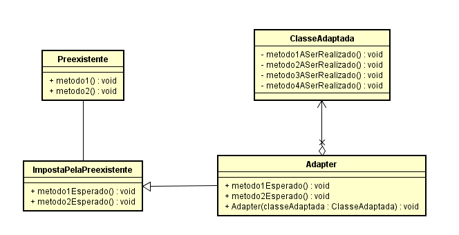
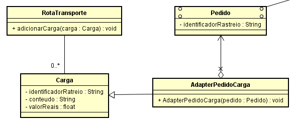

# Qual a finalidade do padrão Adapter?

O Padrão Adapter é um padrão de projeto estrutural que permite que objetos com interfaces incompatíveis colaborem entre si. Ele atua como um “wrapper”, ou seja, um invólucro que adapta a interface de um objeto para outra interface esperada pelo cliente.

A finalidade do padrão Adapter é permitir que você integre componentes que de outra forma não seriam compatíveis devido a diferenças em suas interfaces, simplificando a interação entre esses componentes.

No Object Adapter temo uma classe "preexistente" que faz uso de uma classe, vamos chama-lá de "ImpostaPelaPreexistente", então eu quero que uma outra classe se passe pela "ImpostaPelaPreexistente", e que a classe "Preexistente" consiga usá-la sem distinguir com qual classe estamos usando, vamos chamá-la de "ClasseAdaptada", para isso temos que criar uma classe "Adaptadora" que vai fazer com que a classe "Preexistente" faça uso da "ClasseAdaptada" sem saber que não é a classe "ImpostaPelaPreexistente". 

# Contexto do Código Usado

No nosso código temos a classe "RotaTransporte"("Preexistente"), ela foi feita para usar a classe "Carga"("ImpostaPelaPreexistente"), o nosso objetivo é fazer a classe Pedido("ClasseAdaptada") se passar pela classe "Carga", então nós criamos a classe "AdapterPedidoCarga" que vai herdar da classe "Carga" e possuir um atributo da classe "Pedido", então a classe "AdapterPedidoCarga" implementa os métodos da classe "carga" e retorna os dados da classe "Pedido" através do atributo.

