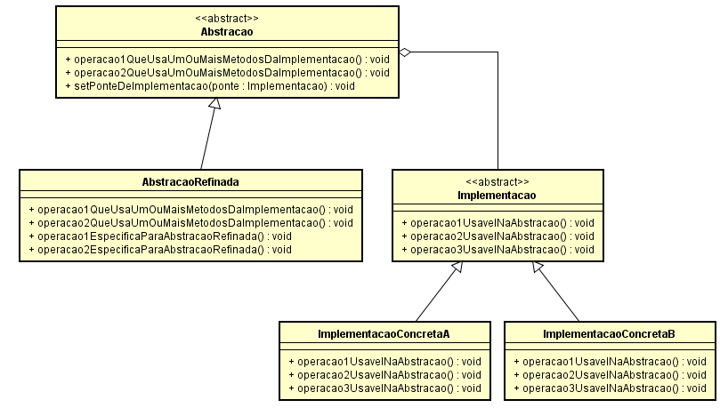
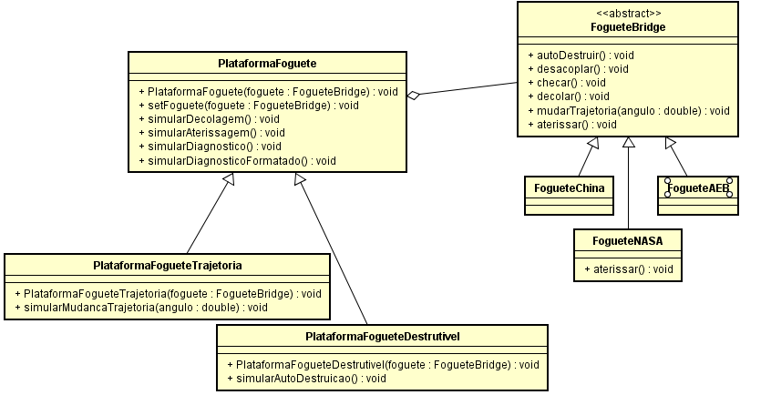

# Qual a Finalidade do Padrão Bridge?

O padrão Bridge é um padrão de projeto estrutural que permite que você divida uma classe grande ou um conjunto de classes intimamente ligadas em duas hierarquias separadas—abstração e implementação—que podem ser desenvolvidas independentemente umas das outras.

No padrão Bridge, a estrutura é composta por um supertipo abstração, geralmente representado por uma classe abstrata ou interface, que declara um conjunto de métodos abstratos. Esses métodos definem a interface para a lógica de negócios, mas deixam a implementação específica para as subclasses.

Cada subclasse concreta da abstração possui uma referência a um objeto da hierarquia de implementação. A abstração delega a maior parte do trabalho real para a implementação, mas como a implementação é acessada através de uma interface comum, as duas hierarquias podem variar e evoluir independentemente.

O padrão Bridge encapsula a lógica de implementação em classes dedicadas, promovendo o princípio do encapsulamento e evitando a exposição direta da implementação ao código cliente. Isso permite que o código cliente permaneça desacoplado das classes concretas de implementação, tornando-o mais flexível, fácil de manter e reutilizável.

Uma das vantagens significativas do padrão Bridge é sua capacidade de facilitar a introdução de novos tipos de implementações no sistema sem modificar o código cliente existente. Isso é alcançado através da adição de novas subclasses de implementação, sem afetar o código cliente.

# Contexto do Código Usado

No nosso código nos temos uma superclasse abstrata chamada “PlataformaFoguete” que serve como a abstração no padrão Bridge. Esta classe define uma interface comum para todas as suas subclasses e delega a execução das funcionalidades para a implementação, que é representada pela superclasse abstrata "FogueteBridge". A superclasse “FogueteBridge” é a base para todas as implementações concretas, que incluem “FogueteAEB”, “FogueteChina” e “FogueteNasa”. Cada uma dessas subclasses concretas fornece uma implementação única dos métodos definidos na superclasse "FogueteBridge". E temos as subclasses da abstração, “PlataformaFogueteTrajetoria” e “PlataformaFogueteDestrutivel”, que estendem a funcionalidade da superclasse “PlataformaFoguete” implementando novos métodos. Esses novos métodos são suportados pelas implementações concretas conforme necessário.

