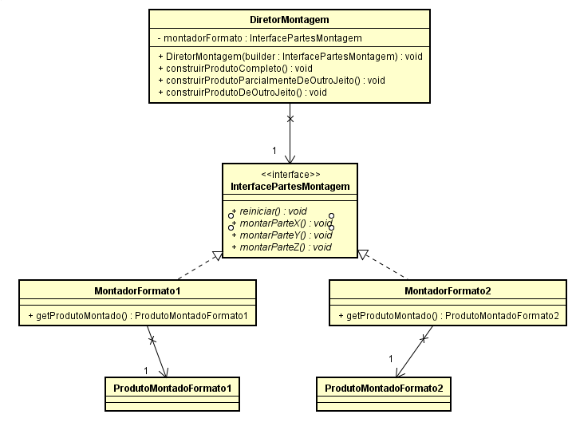

# Qual a finalidade do padrão Builder

O padrão Builder é um padrão de projeto criacional que permite a construção de objetos complexos passo a passo. Ele é útil quando a construção de um objeto requer a configuração de muitos parâmetros ou quando queremos criar diferentes representações do mesmo objeto.

A estrutura do padrão Builder é composta por uma interface Builder que define os métodos necessários para construir o objeto, e classes concretas que implementam essa interface, chamadas de ConcreteBuilder, cada uma responsável por construir uma versão específica do objeto.

Além disso, o padrão Builder permite a construção de objetos complexos de forma flexível, sem expor a complexidade da construção ao cliente. O cliente interage com um diretor, que coordena a construção do objeto usando o Builder correspondente. Isso mantém o código do cliente limpo e fácil de manter, pois o cliente só precisa interagir com o diretor e o Builder.

O padrão Builder oferece grande flexibilidade em termos de design de software. Ele permite que você construa diferentes representações do objeto de forma isolada, sem afetar o código do cliente. Isso facilita a introdução de novos tipos de objetos no programa, sem quebrar o código existente.

# Contexto do código Usado

No nosso código temos:

Interface Builder (ConsultasBuilder): A interface ConsultasBuilder representa o contrato para a construção das consultas SQL. Ela define métodos para construir diferentes partes das consultas, como select, from, where, orderBy, etc.

Montadores Concretos (Concrete Builders): Temos uma classe concreta, ConsultasSqlBuilder, que implementa a interface ConsultasBuilder. Este montador concreto é responsável por construir consultas SQL usando a linguagem SQL padrão. Ele implementa os métodos definidos na interface ConsultasBuilder para criar e compor as partes da consulta, como as cláusulas SELECT, FROM, WHERE e ORDER BY.

Diretor (DiretorConsultas): No contexto de consultas SQL, não necessariamente precisamos de uma classe diretor, pois os clientes podem criar e montar as consultas diretamente usando o montador concreto correspondente.

Além disso, o padrão Builder permite que o código funcione com diferentes tipos de consultas SQL, sem depender de construções diretamente em strings de SQL. Isso é possível porque a interface ConsultasBuilder e os métodos relacionados são geralmente implementados de forma a garantir a construção correta das consultas SQL. O padrão Builder encapsula o processo de construção das consultas SQL, mantendo o código do cliente limpo e fácil de manter.

Essa abordagem facilita a introdução de novos tipos de consultas SQL no programa, sem quebrar o código cliente existente, proporcionando uma maneira mais organizada e flexível de lidar com a construção de consultas complexas no contexto de bancos de dados relacionais.

