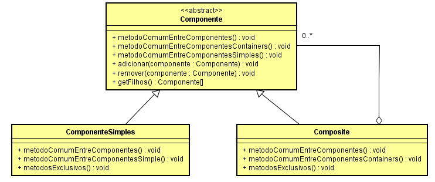

# Qual a finalidade do padrão Composite?

O Padrão Composite é um padrão de projeto estrutural que permite compor objetos em uma estrutura semelhante a uma árvore e trabalhar com eles como se fossem um objeto singular.

A finalidade do padrão Composite é permitir que você trate objetos individuais e composições de objetos de maneira uniforme, simplificando o código e conferindo maior flexibilidade

No Composite temos um supertipo chamado "Componente", que pode ser uma classe abstrata ou uma interface, vai possuir os métodos em comum para objetos simples e objetos containers(Composite), ambos herdando/implementando de "Componente", os objetos simples são os elementos simples da hierarquia, também conhecidos como "folha". Os objetos containers possuem uma coleção do supertipo(Componente) possibilitando assim o armazenamento tanto de outros objetos containers, quanto de objetos simples. Isso permite que os clientes a partir do supertipo tratem objetos simples e compostos de maneira uniforme, sem precisar saber se estão lidando com um objeto simples ou um objeto composto.

O padrão Composite é particularmente útil quando você precisa lidar com estruturas de dados hierárquicas e complexas, como árvores ou gráficos. Ele fornece uma maneira elegante de representar e manipular essas estruturas, facilitando a adição, remoção e manipulação de elementos em diferentes níveis da hierarquia.

# Contexto do código usado

O código usado simula um sistema de arquivos, onde possui pastas("Composite") e arquivos("Objetos Simples").

