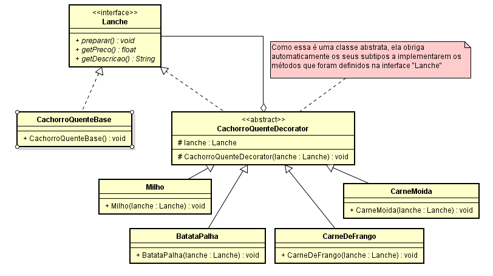

# Qual a finalidade do padrão Decorator?

O padrão Decorator é um padrão de projeto estrutural que permite adicionar comportamento a objetos individualmente, de maneira flexível e dinâmica, sem alterar o código da classe original. Este padrão é especialmente útil quando se deseja estender as funcionalidades de objetos em um sistema de maneira modular.

No padrão Decorator, a estrutura é composta por um componente abstrato, geralmente representado por uma interface ou classe abstrata, que define operações que podem ser alteradas ou estendidas. Os componentes concretos implementam essa interface, fornecendo o comportamento básico dos objetos.

Os decorators são classes que implementam a mesma interface que os componentes e contêm uma referência a um objeto da interface do componente. Essa referência pode ser a um componente concreto ou a outro decorator. Os decorators adicionam ou modificam o comportamento do objeto que estão decorando, e podem fazer isso de forma recursiva.

Ao usar o padrão Decorator, o comportamento adicional é encapsulado em classes separadas, promovendo o princípio da responsabilidade única e a composição sobre a herança. Isso permite que o comportamento adicional seja aplicado a objetos de forma modular e flexível, sem a necessidade de modificar a classe original ou usar uma hierarquia de classes complexa.

Uma das principais vantagens do padrão Decorator é sua capacidade de permitir a adição de funcionalidades a objetos em tempo de execução, de maneira transparente para o código cliente. Isso é alcançado através da composição de decorators, permitindo criar combinações variadas de comportamentos sem alterar o código existente.

# Contexto do Código Usado

No nosso código, temos uma interface chamada “Lanche” que serve como o componente base no padrão Decorator. Esta classe define uma interface comum para todas as suas subclasses e contém a implementação básica dos métodos necessários para criar um lanche.

A classe concreta “CachorroQuenteBase” implementa de “Lanche” e fornece a implementação básica para um cachorro-quente simples. Ela serve como o componente concreto no padrão Decorator.

Para adicionar funcionalidades adicionais ao lanche de forma flexível e dinâmica, utilizamos decorators abstratos. A classe Abstrata “CachorroQuenteDecorator” é um decorator abstrato que implementa de “Lanche” e contém uma referência a um objeto do tipo “Lanche”. Esta classe delega a execução das funcionalidades para o objeto que está decorando, permitindo a adição de novos comportamentos.

Temos diversos decorators concretos que estendem “CachorroQuenteDecorator”, incluindo “BatataPalha”, “Milho”, “CarneDeFrango” e “CarneMoida”. Cada um desses decorators concretos adiciona sua própria funcionalidade específica ao lanche, como adicionar batata palha, milho, carne de frango ou carne moída.

