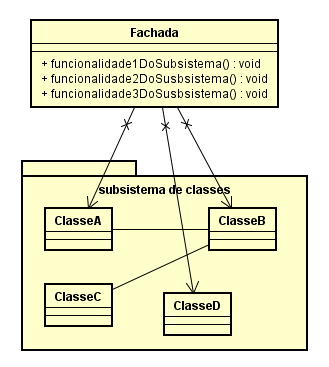
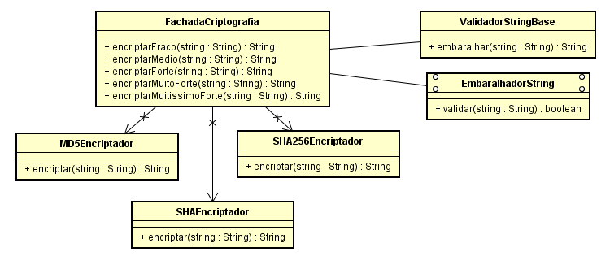

# Qual a finalidade do padrão Façade?

O Padrão Facade é um padrão de projeto estrutural que tem como objetivo fornecer uma interface simplificada para um conjunto de classes, bibliotecas ou frameworks mais complexos. Ele serve como um ponto de acesso único, escondendo a complexidade do subsistema subjacente e facilitando a interação para o cliente.

A principal finalidade do padrão Facade é tornar um sistema mais fácil de usar ao definir uma interface de alto nível que simplifica o acesso a um subsistema complexo. Em vez de os clientes interagirem diretamente com várias classes e métodos do subsistema, o Facade oferece métodos simplificados que encapsulam essa complexidade, tornando a utilização do sistema mais intuitiva e eficiente.

A estrutura do padrão Facade consiste em uma classe Facade que contém métodos acessíveis aos clientes. Estes métodos, por sua vez, delegam as chamadas para os objetos apropriados dentro do subsistema, que é composto por várias classes que realizam tarefas específicas. As classes do subsistema não têm conhecimento da existência do Facade e continuam a operar de maneira independente.

# Contexto do código usado

No código utilizado temos um sistema de encriptação, onde possuimos 3 classes de encriptação("MD5Encriptador", "SHAEncriptador" e "SHA256Encriptador"). A partir dessas classes disponibilizei 5 métodos através da classe "FachadaCriptografia", que vão desde o encriptar fraco até o encriptar muitíssimo forte, que é a classe que o cliente faz uso, sem ser preciso se acoplar a cada uma dessas classes separadamente.

