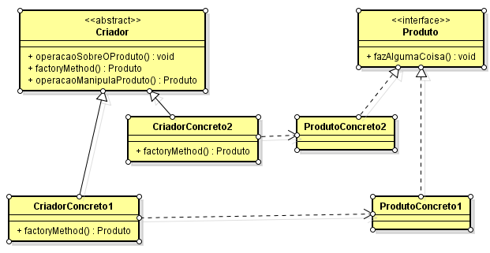
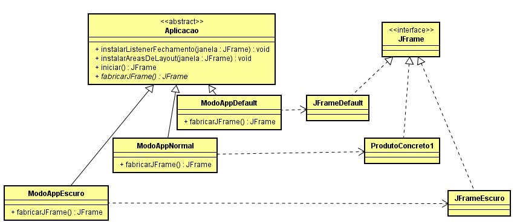

# Qual a finalidade do padrão Factory Method? 
O padrão Factory Method é um padrão de Criação de projeto que fornece uma maneira de delegar a lógica de criação de objetos para subclasses. Isso é útil quando você tem um superclasse com várias subclasses e você quer que a superclasse seja capaz de criar objetos, mas as subclasses decidem quais classes instanciar.

No padrão Factory Method, a estrutura é composta por um supertipo criador, geralmente representado por uma classe abstrata ou interface, que declara um método abstrato chamado factoryMethod. Este método é responsável por definir a assinatura para a criação de objetos, mas deixa a implementação específica para as subclasses.

Cada subclasse concreta do criador implementa o factoryMethod, fornecendo uma implementação única para a criação de um tipo específico de objeto, conhecido como "produto". Esses produtos são instâncias concretas de classes que satisfazem uma determinada interface ou herdam de uma classe comum.

O Factory Method encapsula a lógica de criação de objetos em subclasses dedicadas, promovendo o princípio do encapsulamento e evitando a exposição direta da criação de objetos ao código cliente. Isso permite que o código cliente permaneça desacoplado das classes concretas, tornando-o mais flexível, fácil de manter e reutilizável.

Uma das vantagens significativas do Factory Method é sua capacidade de facilitar a introdução de novos tipos de produtos no sistema sem modificar o código cliente existente. Isso é alcançado através da adição de novas subclasses do criador e dos produtos correspondentes, sem afetar o código cliente.

# Contexto do código usado

No nosso código nós temos a possibilidade de inicializar 3 telas diferentes: Normal, Escuro ou Default. Nós temos o supertipo abstrato "Criador"(Aplicacao) que possui o método abstrato fabricarJFrame, que obriga suas subclasses "ModoAppNormal", "ModoAppEscuro" e "ModoAppDefault"(Criadores Concretos) a implementá-lo e retornar o tipo de "Produto"(JFrame) correspondente, "JFrameClaro", "JFrameEscuro" ou "JFrameDefault".

