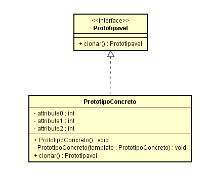
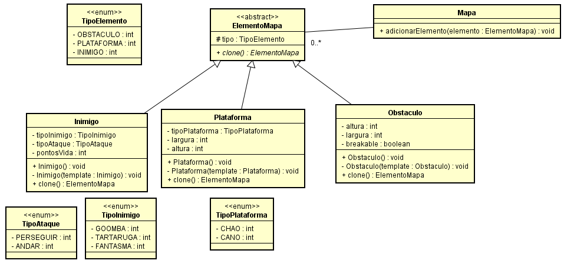

# Qual a finalidade do Padrão Prototype?

O Padrão Prototype é um padrão de projeto que permite criar novos objetos duplicando um protótipo existente, conhecido como "clonagem".

A finalidade do padrão Prototype é proporcionar uma maneira flexível e eficiente de criar novos objetos com base em um modelo existente. Ele elimina a necessidade de recriar objetos complexos a partir do zero, permitindo a clonagem de um protótipo para gerar novas instâncias.

No Prototype, temos um supertipo chamado "ElementoMapa", que pode ser uma classe abstrata ou uma interface. Ele define os métodos comuns para todos os elementos do mapa, incluindo a operação de clonagem. As classes concretas, implementam o supertipo e fornecem suas próprias implementações específicas de clonagem.

O padrão Prototype é particularmente útil quando você precisa criar variações de objetos existentes sem modificar o protótipo original. Ele oferece uma abordagem flexível para a criação de objetos em um sistema, reduzindo a duplicação de código e o acoplamento entre classes.

# Contexto do código usado

No nosso contexto temos um mapa, onde ele possui elementos, esses elementos as vezes podem ser bastante repetido, então para não ficar criando sempre novos elementos, por que não aproveitar os já criados? diminuindo assim o esforço de criação de elementos.

As vezes é meio confuso entender o porque não criar um novo objeto do que fazer um clone, Como esse código é apenas para exemplo, as situações estão em menor escala, mas essas classes prototype Concretas poderiam ter muito mais atributos, ficando mais difícil a criação de um elemento a partir do zero, ou de um padrão fixo, então você pode fazer um clone de uma versão do elemento mais próxima do que você quer e fazer as alterações necessárias 

No nosso código temos o supertipo Prototype("ElementoMapa") como uma classe abstrata, e os subtipos que herdam dela("Inimigo", "Plataforma" e "Obstaculo"), fazendo assim ser possível a funcionalidade de clonar o objeto, tirando o esforço de criar o mesmo do zero, aproveitando os atributos já inicializados anteriormente

