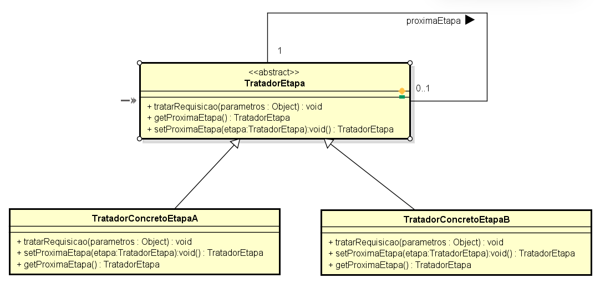
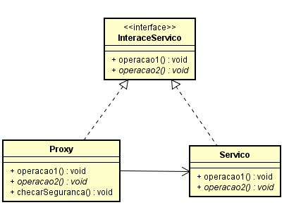
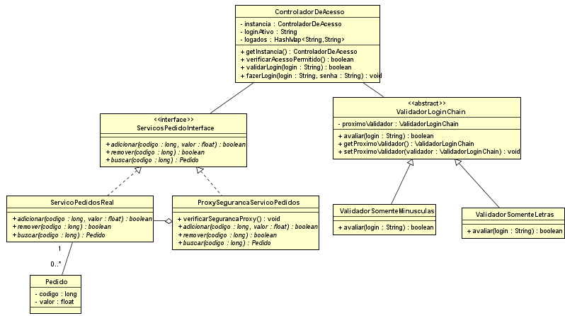

# Qual a finalidade do Padrão Chain of Responsibility?

O Padrão Chain of Responsibility é um padrão de projeto comportamental que permite passar uma solicitação por uma cadeia de manipuladores até que um deles a trate.

A finalidade do padrão Chain of Responsibility é fornecer uma maneira flexível de processar requisições sem acoplar o remetente da solicitação ao seu receptor. Em vez de atribuir diretamente a responsabilidade a um único objeto, o padrão permite que múltiplos objetos tenham a oportunidade de tratar a solicitação, passando-a pela cadeia até que um manipulador apropriado seja encontrado.

No Chain of Responsibility, temos um supertipo chamado "Handler", que pode ser uma classe abstrata ou uma interface. Ele define o método comum para processar a requisição e um mecanismo para passar a solicitação ao próximo manipulador na cadeia. As classes concretas implementam o supertipo e fornecem suas próprias implementações específicas para processar a solicitação.

O padrão Chain of Responsibility é particularmente útil quando você precisa processar requisições de maneiras diferentes, dependendo do contexto, sem modificar o código que faz a solicitação. Ele oferece uma abordagem flexível para o tratamento de requisições em um sistema, reduzindo o acoplamento entre remetentes e receptores e promovendo a reutilização de código.

# Qual a finalidade do Padrão Proxy?

O Padrão Proxy é um padrão de projeto estrutural que fornece um substituto ou ponto de acesso controlado a outro objeto, conhecido como "substituição de controle".

A finalidade do padrão Proxy é atuar como um intermediário entre o cliente e um objeto real, controlando o acesso a ele. O Proxy pode ser usado para diferir a inicialização do objeto, controlar o acesso ao objeto real ou reduzir a carga de trabalho, realizando operações básicas antes de encaminhar a solicitação para o objeto real.

No Proxy, temos um supertipo chamado "Sujeito", que pode ser uma classe abstrata ou uma interface. Ele define os métodos comuns que tanto o Proxy quanto o objeto real devem implementar. A classe Proxy implementa esse supertipo e gerencia a interação com o objeto real, que também implementa o mesmo supertipo.

O padrão Proxy é particularmente útil quando você precisa controlar o acesso a um objeto que é caro para criar ou executar. Ele oferece uma abordagem flexível para a gestão de recursos e a otimização do desempenho em um sistema, ao mesmo tempo em que mantém a interface do cliente consistente e desacoplada do objeto real.

# Contexto do código usado

No nosso código, na parte do chain of Responsibility, temos um validador de login, onde temos duas etapas(poderiam ter quantas fossem necessárias) de validação do login, a primeira valida se o login possui apenas letras, e o segundo valida se as letras são apenas minúsculas

No nosso exemplo, temos o supertipo ("ValidadorLoginChain"), e dois subtipos("ValidadorSomenteLetras" e "ValidadorSomenteMinusculas"), no supertipo, possuimos um atributo chamado "proximoValidador", que é do mesmo tipo da super classe, nele é possivel designar qual será o proximo validador da cadeia(a ordem, pelo menos nesse exemplo, é definida a tempo de compilação, mas poderiamos deixar a escolha do cliente caso fizesse sentido), quando não possui um "proximoValidador" significa que a validação foi bem sucedida, ou seja, instanciamos os subtipos e definimos a sequência que desejamos(subtipo.setProximo(subTipo2) - subtipo2.setProximo(...)) e assim sucessivamente!

Já na parte do Padrão Proxy, temos um sistema de pedidos em que eu preciso estar logado para poder manipulá-los(adicionar, remover e buscar), o Proxy que faz essa checagem se está tudo certo com o login, através da classe("ControleDeAcesso") que possui os atributos que indicam se está logado ou não.

Nele temos uma interface("ServicoPedidoInterface") que disponibiliza os métodos que as subclasses terão em comum, temos a subclasse("ServicoPedidoReal") que manipula o pedido, ou seja, disponibiliza métodos de criação, remoção e busca de pedidos, e a subclasse("ProxySegurancaServicoPedidos") que serve como um controle para a classe("ServicoPedidoReal"), ela checa se o usuário está logado para liberar o acesso ou impedir o acesso caso contrário. 

