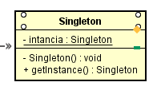
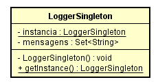

# Qual a finalidade do Padrão Singleton?

O padrão Singleton é um padrão de projeto criacional que tem como objetivo garantir que uma classe tenha apenas uma instância, enquanto fornece um ponto de acesso global para essa instância.

Ele resolve dois problemas principais:

Garantir que uma classe tenha apenas uma única instância: Isso é útil para controlar o acesso a algum recurso compartilhado, como uma base de dados ou um arquivo. Por exemplo, se você criar um objeto e depois decidir criar um novo, em vez de receber um objeto novo, você obterá o que já foi criado.
Fornecer um ponto de acesso global para aquela instância: Assim como uma variável global, o padrão Singleton permite que você acesse algum objeto de qualquer lugar no programa. No entanto, ele também protege essa instância de ser sobrescrita por outro código.

O padrão Singleton tem duas variações principais que são comumente usadas:

**Singleton Eager**: Nesta variação, a instância do Singleton é criada no momento em que a classe é carregada, independentemente de ser necessária ou não. Isso é feito declarando e inicializando a instância como uma variável estática na classe Singleton. Embora essa abordagem seja simples e funcione na maioria dos casos, ela pode levar a problemas de desempenho se a criação da instância for cara e ela não for necessária imediatamente.
**Singleton Lazy**: Nesta variação, a instância do Singleton é criada apenas quando é realmente necessária. Isso é feito verificando se a instância já existe cada vez que o método de acesso é chamado. Se a instância não existir, ela é criada. Essa abordagem é mais eficiente em termos de recursos.

# Contexto do código usado 

No nosso contexto, estamos utilizando a versão Lazy(tardia) do Singleton, nós temos como classe que adota o padrão a classe "LoggerSingleton", ela possui o contrutor privado e possui um método estático que retorna a instância caso tenha sido requisitado anteriormente ou uma nova intância caso seja a primeira vez usando a classe, ela serve para guardar mensagens informativas sobre o cadastro de pessoas, sendo assim, nós temos que manter um histórico das mensagens, para que não se perca esse histórico em cada nova instância da classe Logger, nós aplicamos o padrão Singleton e garantimos que a classe possua apenas UMA instância

