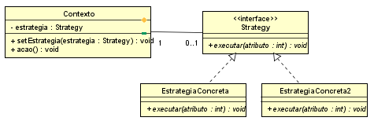

# Qual a finalidade do Padrão Strategy?

O Padrão Strategy é um padrão de projeto comportamental que permite definir uma família de algoritmos, encapsulá-los em classes separadas e torná-los intercambiáveis. Ele permite que o algoritmo varie independentemente dos clientes que o utilizam.

A finalidade do padrão Strategy é oferecer uma maneira flexível de selecionar e utilizar diferentes algoritmos ou comportamentos em tempo de execução, sem alterar o código do cliente. Ele separa o algoritmo da lógica que o utiliza, promovendo a reutilização de código e a aplicação de diferentes comportamentos de maneira modular.

No Strategy, temos um supertipo chamado "Estrategia", que pode ser uma classe abstrata ou uma interface. Ele define um método comum que todas as estratégias concretas devem implementar. As classes concretas implementam esse supertipo e fornecem suas próprias versões do algoritmo. O cliente seleciona a estratégia desejada em tempo de execução e a utiliza através do supertipo.

O padrão Strategy é particularmente útil quando você precisa aplicar diferentes variações de um algoritmo ou comportamento sem modificar o código que o usa. Ele oferece uma abordagem flexível e extensível para a implementação de diferentes soluções, promovendo o princípio de aberto/fechado, onde as classes são abertas para extensão, mas fechadas para modificação.

# Contexto do código usado 

No nosso código usado, temos disponíveis vários algoritmos de ordenação para ordenar um vetor com 100 números de 09 dígitos cada, a escolha do algoritmo de ordenação pode ser feita pelo cliente se necessário, esse exemplo faz tanto sentido em uma aplicação do mundo real, o foco aqui é mostrar como o padrão Strategy funciona.

Temos no código a classe contexto("Ordenador") que serve Strategy como intermediária entre o cliente e a estratégia concreta que será utilizada, temos a InterfaceStrategy("AlgoritmoOrdenacaoStrategy") que possui o método que todas as Estratégias concretas devem prover, e temos as Estratégias concretas(Algoritmos de Ordenação) que implementam o método da interface de forma específica de cada algoritmo.

